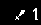
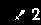

# Mind-Collector

A Pipeline suited for psychophysiological data acquisition and event annotation. The pipeline is composed of **Triggers** and **Recorders**. **Triggers** are responsible for creating events, while **Recorders** are responsible for collecting and annotating data. The pipeline is designed to be modular, so you can easily add new **Triggers** and **Recorders**.

## Available Recorders

**Recorder** is a Process that listens for incoming events emited by **Triggers**. It is responsible for collecting and annotating data. You can run multiple recorders at the same time.

### EEG LSL Recorder
It listens for a LSL stream and save. The data with annotations is saved as JSON Lines file.
For creating a stream for a specific device, you can use [CortexBCIStreamer](https://github.com/BRomans/CortexBCIStreamer).

### EegUdp Recorder
This recorder listens for incoming EEG data. It adds a column to the data and if the event is triggered, it annotates the data with the event name. The data is saved in a CSV file.

### Camera Recorder *(only one camera recorder may run at a time)*
Records a video from the user's camera. The video is saved in a .avi file.

### Camera Triggered Recorder *(only one camera recorder may run at a time)*
After the event is triggered, the camera records the user's reaction. 

### Screen Recorder
This recorder takes screenshots of the user's screen throught the whole experiment.

 

## Available Triggers

A **Trigger** is a process that creates events based on certain inputs. These inputs can come from a user (like his facial expressions), a game (such as a scoreboard update), or the trigger itself (like simulating a button click). You can have several Triggers running simultaneously.

### Screenshot Triggered Markers

Levereges part of the screen to mark an event, when the view changes (player died, killed an enemy, etc). The user can seamlesly specify the region of the screen to be monitored (look at [tools](./tools/README.md)). 

After specifying the region, the process takes screenshots at a fixed interval and compares the images. If the images are different, the process triggers an event. This is useful to monitor the player's performance in a game, like League of Legends, where the player's KDA (Kills, Deaths, Assists) is always displayed on the screen.

    
    

### Random Click Trigger
This option enables to trigger an event (like Flash) at random intervals. The user can specify the range of the intervals and the key to be pressed. In this way, the user can simulate a real-life scenario where the player is trolled by the game.

## Usage
1. Install dependencies - `pip install -r requirements.txt`
2. Configure the triggers and recorders in the [configuration.py](./configuration.py) file.
3. Run the main script - `python main.py`

## Development
Each Trigger and Recorder requires 2 classes - one that configures the process and another that runs the process. The configuration class is responsible for setting up the process, while the running class is responsible for executing the process. To run the feature, You need to wrap these classes with [Factory](./src/utils/config_helpers.py) inside [configuration.py](./configuration.py).
